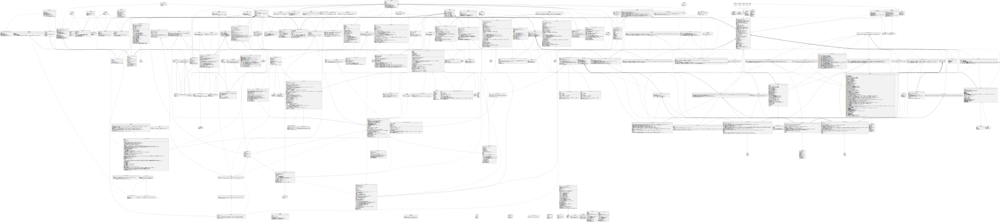

[](https://github.com/DistributedCollective/Sovryn-smart-contracts/actions/workflows/node.js.yml) [](https://coveralls.io/github/DistributedCollective/Sovryn-smart-contracts?branch=development)

# Sovryn v 0.1 Smart Contracts

## Dependencies

- [git](https://git-scm.com/book/en/v2/Getting-Started-Installing-Git) - tested with v2.25.1
- [node.js & npm](https://www.npmjs.com/get-npm) - tested with node.js v10.19.0 and npm v6.14.4
- curl - tested with v7.68.0
- [yarn](https://classic.yarnpkg.com/en/docs/install/) - tested with v1.22.5
- [python3](https://www.python.org/downloads/release/python-385/) v3.8.5 or greater, python3-dev
- [pip3](https://pip.pypa.io/en/stable/installing/) - tested with v20.0.2
- [ganache-cli](https://github.com/trufflesuite/ganache-cli) - tested with [v6.9.1](https://github.com/trufflesuite/ganache-cli/releases/tag/v6.9.1)
- [brownie](https://github.com/eth-brownie/brownie/) v1.12.4 or greater
- [solc-select](https://github.com/crytic/solc-select) only if you are having multiple solc installed locally and globally.

## Setup and Testing

First install all the npm packages:

```
npm ci
```

And then install all the python packages using pip3:

```
pip3 install -r requirements.txt
```

To run prettier:

```
npm run prettier
```

To run linting of contracts:

```
npm run lint-contracts
```

To analyze the contracts using Slither:

```
npm run analyze-contracts
```

To run the tests written in python:

```
npm run test
```

To run tests written in JS:

```
npm run test
```

To check the test coverage of JS:

```
npm run coverage
```

Note: Sometimes it might show an error "JavaScript heap out of memory", then please increase the memory allocation using:

```
export NODE_OPTIONS=--max_old_space_size=4096
```

If still the error persists, make sure that you closed the shell and opened another shell. Also, if possible, increase the number from `4096` to a higher number in the above command.

## Deployment on RSK testnet

1. Add account with RBTC balance to brownie

```bash
brownie accounts new rskdeployer
```

2. Add network Rsk-testnet

```bash
brownie networks add rsk testnet host=https://testnet.sovryn.app/rpc chainid=31
```

OR

```bash
brownie networks add rsk testnet host=https://public-node.testnet.rsk.co chainid=31
```

Note: If you want to work with mainnet, please use host as `wss://mainnet.sovryn.app/ws` and chainid as `30`

3. Deploy contracts locally

```bash
brownie run deploy_everything.py
```

or use an absolute path to the script

```bash
brownie run ~/Code/Sovryn-smart-contracts/scripts/deployment/deploy_everything.py
```

4. Deploy contracts on testnet

```bash
brownie run deploy_everything.py --network testnet
```

or use an absolute path to the script

```bash
brownie run ~/Code/Sovryn-smart-contracts/scripts/deployment/deploy_everything.py --network testnet
```

## Sovryn Swap joint testing for RSK (local)

1. Start `ganache` with

```bash
ganache-cli --gasLimit 6800000 --port 8545
```

Overriding default `brownie` port will make it connect to our local chain and keep it open.

If you changed the port in the brownie config, use that port instead.

2. Deploy contracts

```bash
brownie run deploy_everything.py
```

or use an absolute path to the script

```bash
brownie run ~/Code/Sovryn-smart-contracts/scripts/deployment/deploy_everything.py
```

3. Copy `SUSD` and `RBTC` token addresses from the command line output

4. Use addresses from #2 as reserves in the SovrynSwap codebase (`solidity/utils/config`)

5. Deploy SovrynSwap contracts using the same chain and the updated config. Consult the README in `solidity/utils`.

6. After deployment, copy the address of the deployed `ContractRegistry` and update the `scripts/swap_test.json` accordingly.

7. Run the `swap_test.py` script to set the SovrynSwap ContractRegistry address

```bash
brownie run swap_test.py
```

or use an absolute path to the script

```bash
brownie run ~/Code/Sovryn-smart-contracts/scripts/swapTest/swap_test.py
```

## MoC Oracle Deploy (testnet or mainnet)

1. Get MoC medianizer SC address (BTC to USD)

- Testnet: 0x667bd3d048FaEBb85bAa0E9f9D87cF4c8CDFE849
- Mainnet: See [MoC Contracts verification.md](https://github.com/money-on-chain/main-RBTC-contract/blob/master/Contracts%20verification.md)

2. Modify `scripts/deploy_protocol.py`

   a. Deploy PriceFeedsMoC.sol

   ```python
   price_feed_moc = acct.deploy(PriceFeedsMoC, moc_medianizer_address)
   ```

   b. instead of deploy PriceFeedsLocal use PriceFeeds.sol

   ```python
   feeds = acct.deploy(PriceFeeds, tokens.wrbtc.address, sovryn.address)
   ```

   c. Set price feeds

   ```python
   feeds.setPriceFeed([tokens.rbtc.address, ...], [price_feed_moc.address, ...])
   ```

## Smart Contract Usage

### 0. Overview


##### 0.1 The components

The smart contracts consist of 3 main components:

1. The lending pools aka loan tokens
2. The Sovryn trading protocol
3. The Sovryn swap network

1 + 2 are part of this repository. 3 can be found in oracle-based-amm.

The watcher is a separate component located in its own repository. It does all of the work which requires an external watcher: liquidating and rolling over position and balancing the AMM.

##### 0.2 The processes

###### 0.2.1 Lending

The user provides funds to the lending pool using the `mint` function and withdraws funds from the lending pool using the `burn` function. Mint and burn refer to minting and burning iTokens. iTokens represent a share of the pool and gather interest over time.

###### 0.2.2 Trading

In order to open a margin trade position, the user

1. calls `marginTrade` on the loan token contract.
2. The loan token contract provides the loan and sends it for processing to the protocol proxy contract.
3. The protocol proxy contract uses the module `LoanOpening` to create a position and swap the loan tokens to collateral tokens.
4. The Sovryn Swap network looks up the correct converter and swaps the tokens.

If successful, the position is being held by the protocol proxy contract, which is why positions need to be closed at the protocol proxy contract. There are 2 ways to close a position. They are explained in the sections 3.2 and 4.2.

###### 0.2.3 Borrowing

Borrowing works similar to a trade. The user takes a loan from the loanToken contract, which tells the protocol to swap it to the currency of the collateral. The borrowed amount is paid out to the user instead of being held by the protocol. Therefore, each loan needs to be overcollateralized.

###### 0.2.4 Providing liquidity to the AMM

No trading and no borrowing can take place without a swap. Users can add and remove one-sided liquidity by calling `addLiquidity` or `removeLiquidity` on the LiquidityV2Converter contract. The AMM can be found in oracle-based-amm.

###### 0.2.5 Liquidation

Whenever the current margin of a loan falls below maintenance margin, it needs to be liquidated. Anybody can initiate a liquidation and buy the collateral tokens at a discounted rate (5%). Liquidation is implemented in the `LoanClosing` module.

###### 0.2.6 Rollover

Each loan has a duration. In case of a margin trade it is set to 28 days, in case of borrowing, it can be set by the user. On loan opnening, the user pays the interest for this duration in advance. If closing early, he gets the excess refunded. If it is not closed before the end date, it needs to be rolled over. On rollover the interest is paid for the next period. In case of margin trading it's 28 days, in case of borrowing it's a month.

###### 0.2.7 Direct swaps

The AMM allows for spot trading by interacting with the network contract directly. This is what the arbitraging procedure of the watcher is doing. The AMM tries to keep the balances of its reserves in equilibrium and therefore adjusts the rates to incentivize user to restore the balance. For an excellent explanation, look up this [article](https://blog.bancor.network/breaking-down-bancor-v2-dynamic-automated-market-makers-4e90c0f9a04 "https://blog.bancor.network/breaking-down-bancor-v2-dynamic-automated-market-makers-4e90c0f9a04").

### 1. Parameter setup

##### 1.1 Loan Pool

To set the loan pool parameter, you need to call `setLoanPool` on the protocol contract.

`setLoanPool` is expecting the following parameter:

```
address[] calldata pools,
address[] calldata assets
```

`pools` is an array of iToken addresses.

`assets` is an array of underlying asset addresses.

For example: The underlying asset of iSUSD is sUSD.

##### 1.2 Margin Pool

To set up the margin pool parameter, you need to call `updateSettings` on the iToken contract (LoanToken.sol).

`updateSettings` is expecting the following parameter:

```
address settingsTarget,
bytes memory callData
```

`settingsTarget` is the address of the settings contract (LoanTokenSettingsLowerAdmin.sol)

`callData` is the encoded input for `setupLoanParams` on the settings contract, which expects an array of `LoanParams`, a struct defined in LoanParamsStruct.sol.

A `LoanParams` object consists of following fields:

```
bytes32 id;
bool active;
address owner;
address loanToken;
address collateralToken;
uint256 minInitialMargin;
uint256 maintenanceMargin;
uint256 maxLoanTerm;
```

`id` is the id of loan params object. Can be any bytes32.

`active` tells if this object can be used for future loans.

`owner` owner of this object (typically the contract owner).

`loanToken` the underlying token. For example: sUSD in case of iSUSD. If calling `updateSetting` this value can be left empty, because it will be overwritten anyway.

`collateralToken` the required collateral token. For example: rBTC in case of iRBTC.

`minInitialMargin` The minimum initial margin in percent with 18 decimals. For example: 20e18 for 20%.

`maintenanceMargin` The minimum margin in percent with 18 decimals. If the margin drops below this value, the loan can and should be liquidated.

`maxLoanTerm` The maximum loan term. If calling `updateSetting` this value can be left empty, because it will be overwritten anyway (28 days).

##### 1.3 Interest rates

Interest rates are being set up by calling `setDemandCurve` on the loanToken contract. The formula for the interest rate is:
`interestRate = baseRate + utilizationRate * rateMultiplier`

### 2. Lending

##### 2.1 Providing funds to the pool

In order to provide funds to the pool, call `mint` on the respective iToken contract. This will take your deposit and give you iTokens in return. If you want to provide sUSD, call it to the iSUSD contract. If you want to provide rBTC, call it to the iRBTC contract.

`mint` is expecting following parameter:

```
address receiver,
uint256 depositAmount
```

`receiver` is the user address.

`depositAmount` is the amount of tokens to be provided (not the number of iTokens to mint).

The function retrieves the tokens from the message sender, so make sure to first approve the iToken contract to access your funds. This is done by calling `approve(address spender, uint amount)` on the ERC20 token contract, where spender is the iToken contract address and amount is the amount to be deposited.

##### 2.2 Withdrawing funds from the pool

In order to withdraw funds to the pool, call `burn`on the respective iToken contract. This will burn your iTokens and send you the underlying token in exchange.

`burn` is expecting the following parameter:

```
address receiver,
uint256 burnAmount
```

`receiver` is the user address.

`burnAmount` is the amount of tokens to be burned (not the number of underlying tokens to withdraw).

### 3. Margin trade

##### 3.1 Enter a trade

In order to enter a trade, call `marginTrade` on the respective iToken contract.
Let's say you want to trade RBTC against SUSD. You enter a BTC long position by sending either of these currencies to the iSUSD contract and a short position by sending either of them to the iRBTC contract. The process is depicted below.


If you are sending ERC20 tokens as collateral, you first need to approve the iToken contract to access your funds. This is done by calling `approve(address spender, uint amount)` on the ERC20 token contract, where spender is the iToken contract address and amount is the required collateral.

`marginTrade` is expecting the following parameter:

```
bytes32 loanId,
uint256 leverageAmount,
uint256 loanTokenSent,
uint256 collateralTokenSent,
address collateralTokenAddress,
address trader,
bytes memory loanDataBytes
```

`loanId` is 0 in case a new loan is opened for this position (the case most of the time). If an existing loan is used, this ID needs to be passed.

`leverageAmount` is telling, if the position should open with 2x, 3x, 4x or 5x leverage. It is expected to be passed with 18 decimals.

`loanTokenSent` and `collateralTokenSent`are telling the contract about the amount of tokens provided as margin. If the margin is provided in the underlying currency of the iToken contract (e.g. SUSD for iSUSD), the contract will swap it to the collateral token (e.g. RBTC). The user can provide either one of the currencies or both of them.

`collateralTokenAddress`specifies which collateral token is to be used. In theory an iToken contract can support multiple tokens as collateral. Which tokens are supported is specified during the margin pool setup (see above). In our case, there are just two tokens: RBTC and SUSD. RBTC is the collateral token for iSUSD and SUSD is the collateral token for iRBTC.

`trader` is the user's wallet address.

`loanDataBytes` is empty in case of ERC20 tokens.

##### 3.2 Close a position

There are 2 functions for ending a loan on the protocol contract: `closeWithSwap` and `closeWithDeposit`. Margin trade positions are always closed with a swap.

`closeWithSwap` is expecting following parameter:

```
bytes32 loanId,
address receiver,
uint256 swapAmount,
bool returnTokenIsCollateral,
bytes memory loanDataBytes
```

`loanId` is the ID of the loan, which is created on loan opening. It can be obtained either by parsing the Trade event or by reading the open loans from the contract by calling `getActiveLoans` or `getUserLoans`.

`receiver` is the user's address.

`swapAmount` defines how much of the position should be closed and is denominated in collateral tokens (e.g. rBTC on a iSUSD contract). If `swapAmount >= collateral`, the complete position will be closed. Else if `returnTokenIsCollateral == True` `(swapAmount/collateral) * principal` will be swapped (partial closure). Else the closure amount will be the principal's covered amount

`returnTokenIsCollateral` pass `true` if you want to withdraw remaining collateral + profit in collateral tokens (e.g. rBTC on a iSUSD contract), `false` if you want to withdraw it in loan tokens (e.g. sUSD on a iSUSD contract).

`loanDataBytes` is not used at this point. Pass empty bytes.

### 4. Borrowing

##### 4.1 Borrow - take a loan

Borrowing works similar to margin trading, just that the borrowed amount is withdrawn by the user instead of being held by the protocol. Just like with margin trading, the collateral is held in a differnet currency than the loan token. In our rBTC/sUSD example, sUSD is being used as collateral for rBTC and vice versa. In contrast to the margin trade call, it's not possible to send loan tokens, but collateral tokens must be sent: 150% of the withdrawn amount converted to collateral tokens.

`borrow` expects following parameter:

```
bytes32 loanId,
uint256 withdrawAmount,
uint256 initialLoanDuration,
uint256 collateralTokenSent,
address collateralTokenAddress,
address borrower,
address receiver,
bytes memory loanDataBytes
```

`loanId` is the ID of the loan, 0 for a new loan

`withdrawAmount` is the amount to be withdrawn (actually borrowed)

`initialLoanDuration` is the duration of the loan in seconds. if the loan is not paid back until then, it'll need to be rolled over

`collateralTokenSent` is the amount of collateral token sent (150% of the withdrawn amount worth in collateral tokens). If the collateral is rBTC,
`collateralTokenSent` needs to be added as value to the transaction as well.

`collateralTokenAddress` is the address of the token to be used as collateral. cannot be the loan token address

`borrower` is the address of the user paying for the collateral

`receiver` is the address to receive the withdrawn amount

##### 4.2 Close the loan

Loans can either be closed with a swap like explained in 3.2, or with a deposit. Closing with deposit might be considered the standard behaviour. With `closeWithDeposit` the user pays back the loan fully or partially by sending loan tokens to the protocol contract. But users should always have the choice if they prefer to pay back the loan in loan tokens or pay it from their collateral.

`closeWithDeposit` expects the following parameter:

```
bytes32 loanId,
address receiver,
uint256 depositAmount
```

`loanId`is the id of the loan

`receiver` is the receiver of the collateral

`depositAmount` defines how much of the position should be paid back. It is denominated in loan tokens.

### 5. Loan Maintainanance

##### 5.1 Add margin

In order to add margin to a open position, call `depositCollateral` on the protocol contract.

`depositCollateral` expects following parameter:

```
bytes32 loanId,
uint256 depositAmount
```

`loanId` is the ID of the loan

`depositAmount` is the amount of collateral tokens to deposit.

##### 5.2 Rollover

When the maximum loan duration has been exceeded, the position will need to be rolled over. The function `rollover` on the protocol contract extends the loan duration by the maximum term (28 days for margin trades at the moment of writing), pays the interest to the lender and refunds the caller for the gas cost by sending 2 \* the gas cost using the fast gas price as base for the calculation.

`rollover` expects following parameter:

```
bytes32 loanId,
bytes calldata loanDataBytes
```

`loanId` is the ID of the loan.

`loanDataBytes` is a placeholder for future use. Send an empty bytes array.

### 6. Liquidation Handling

##### 6.1 Liquidate a position

In order to liquidate an open position, call `liquidate` on the protocol contract. Requirements:

- current margin < maintenance margin
- liquidator approved the protocol to spend sufficient tokens

`liquidate` will compute the maximum seizable amount and buy it using the caller's tokens. Therefore, the caller needs to possess enough funds to purchase the tokens. The liquidator gets an discount on the collateral token price. The discount is set on State.sol and is called `liquidationIncentivePercent`. Currently, it is hardcoded to 5%.

`liquidate` expects following parameter:

```
bytes32 loanId,
address receiver,
uint256 closeAmount
```

`loanId` is the ID of the loan

`receiver` is the address receiving the seized funds

`closeAmount` is the amount to liquidate. If closeAmount > maxLiquidatable, the maximum amount will be liquidated.

### 7. Reading data from the contracts

##### 7.1 Loans

You can read all active loans from the smart contract calling `getActiveLoans`. All active loans for a specific user can be retrieved with ` getUserLoans`. Both function will return a array of `LoanReturnData` objects.
To query a single loan, use `getLoan`.

`LoanReturnData` objects contain following data:

```
bytes32 loanId;
address loanToken;
address collateralToken;
uint256 principal;
uint256 collateral;
uint256 interestOwedPerDay;
uint256 interestDepositRemaining;
uint256 startRate;
uint256 startMargin;
uint256 maintenanceMargin;
uint256 currentMargin;
uint256 maxLoanTerm;
uint256 endTimestamp;
uint256 maxLiquidatable;
uint256 maxSeizable;
```

` loanId` is the ID of the loan

`loanToken` is the address of the loan token

`collateralToken` is the address of the collateral token

`principal` is the complete borrowed amount (in loan tokens)

`collateral` is the complete position size (loan + margin) (in collateral tokens)

`interestOwedPerDay` is the interest per day

`startRate` is the exchange rate at the beginning (collateral token to loan token)

`startMargin` is the margin at the beginning (in percent, 18 decimals)

`maintenanceMargin` is the minimum margin. If the current margin drops below, the position will be partially liquidated

`currentMargin` is the current margin

`maxLoanTerm` is the max duration of the loan

`endTimestamp` afterwards the loan needs to be rolled over

`maxLiquidatable` is the amount which can be liquidated (in loan tokens)

`maxSeizable ` is the amount which can be retrieved through liquidation (in collateral tokens)

##### 7.2 Supply and Demand

`totalAssetSupply()` returns the total amount of funds supplied to the iToken contract by the liquidity providers (lenders).

`totalAssetBorrow()` returns the total amount of funds which is currently borrowed from the smart contract.

##### 7.3 Interest Rates

To read the current interest rate for liquidity providers (lenders), call `supplyInterestRate()` . If you would like to obtain the potential interest rate after x assets are being lent to the contract, use `nextSupplyInterestRate(x)`

To read the current interest rate for borrowers and/or traders, call `borrowInterestRate()`. If you would like to determine the interest rate to be paid considering the loan size x `nextBorrowInterestRate(x)`.

`avgBorrowInterestRate()` returns the average interest rate paid by borrowers at the moment. Since the interest rate depends on the ratio demand/supply, some borrower are paying more than others.

##### 7.4 iToken Price

`tokenPrice()` returns the current iToken price denominated in underlying tokens. In case of iSUSD, the price would be given in SUSD.

##### 7.5 Lender Balances

Each lender has 2 balances on the iToken contract. The balance of iTokens (e.g. iSUSD) and the balance of underlying tokens (e.g. SUSD).

`balanceOf(address)` returns the iToken balance of the given address.

`assetBalanceOf(address)` returns the underlying token balance of the given address.

### 8. Remarks

The loan token (iToken) contract as well as the protocol contract act as proxies, delegating all calls to underlying contracts. Therefore, if you want to interact with them using web3, you need to use the ABIs from the contracts containing the actual logic or the interface contract.

ABI for `LoanToken` contracts: `LoanTokenLogicLM` (if the underlying asset is any but RBTC) and `LoanTokenLogicWrbtc` (if the underlying asset is RBTC)

ABI for `Protocol` contract: `ISovryn`

### 9. SOV Reward Payments

#### 9.1 Setup

When deploying the protocol you need to:

1.  Configure the protocol address. It is an ERC20 token.
2.  Configure price rates between loan and protocol tokens. Using PriceFeeds
3.  Mint or approve tokens to protocol.
4.  Deposit protocol token. `sovryn.depositProtocolToken(amount)`

#### 9.2 Payment

When a user calls one of the below functions the protocol pays SOV rewards.

- closeWithSwap
- closeWithDeposit
- extendLoanDuration
- reduceLoanDuration
- borrow
- marginTrade
- rollover
- liquidate

The function which pays the reward is `PayFeeReward` from `FeesHelper.sol`.

#### 9.3 Withdraw

The protocol can withdraw SOV tokens using `sovryn.withdrawProtocolToken()` from `ProtocolSettings.sol`. This function is executable only by the owner.

## UML



## Contributing

<a href="https://github.com/DistributedCollective/Sovryn-smart-contracts/graphs/contributors">
  
</a>

## License

This project is licensed under the [Apache License, Version 2.0](LICENSE).
