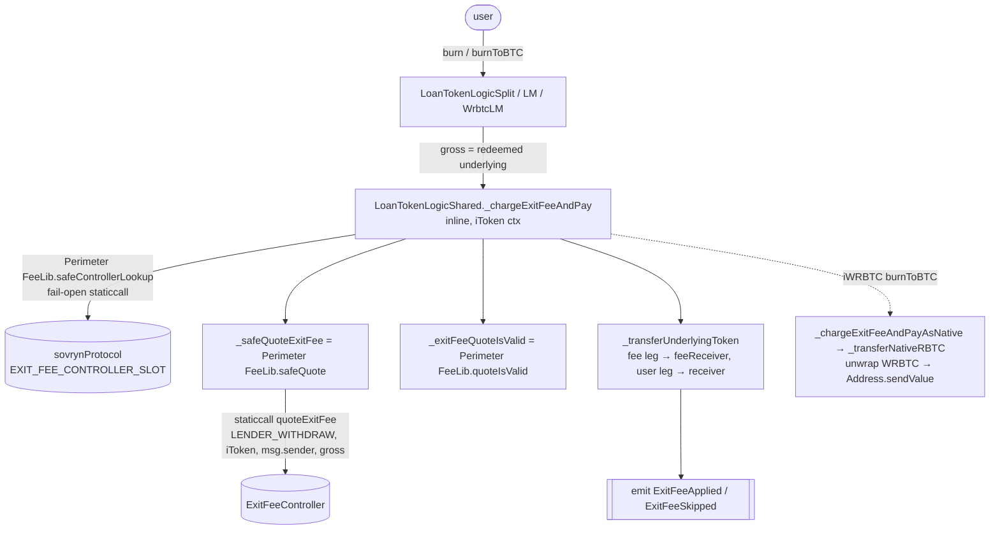
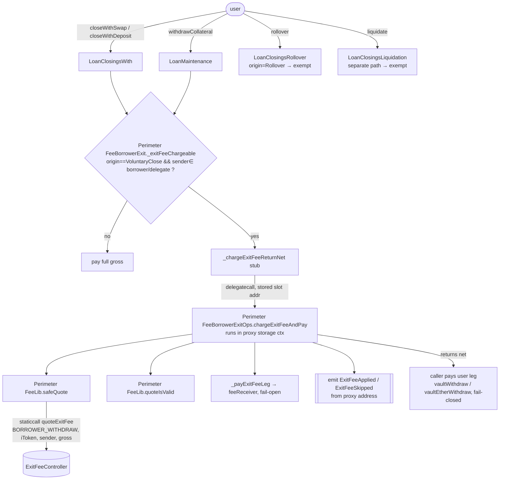

# Perimeter Fee — call graph (who / when / where)

High-level map of the on-chain Perimeter Fee (collateral/exit-fee) machinery in
`Sovryn-smart-contracts`: the entities, which one runs on which user action, and
in what execution context.

> Companion to the feature design in `perimeter/docs/IMPLEMENTATION_DESIGN.md`.
> This file is the Sovryn-side **call graph**; the design doc is the spec.

## Entities

| Entity | Kind | Role |
|---|---|---|
| **ExitFeeController** | external deployed contract (perimeter repo) | Owns the *policy*: per-surface / sub-product / actor rates, the global enable flag, the fee receiver. Products only ever `quoteExitFee(...)` it (staticcall, read-only). |
| **IExitFeeController** | cross-pragma interface | ABI both products use to call the controller. Declares the controller's own *config* events (`ExitFeeEnabledSet`, …) — **not** the product events. |
| **Perimeter FeeLib** | `internal` library (inlined, not deployed) | Shared primitive: `getController`/`setController` (the EIP-1967 slot), `safeQuote` (staticcall + decode, fail-open), `quoteIsValid` (invariants). Inlined into **both** trees. |
| **Perimeter FeeBorrowerExitOps** | deployed `contract is State, IPerimeter FeeEvents` (deployed once, reached only by `delegatecall`) | The **protocol-side** charge hook body (quote → validate → fee-leg transfer → events). Kept off-module for EIP-170; a contract (not a library) so it reads `wrbtcToken` by name and inherits the events. Its address is STORED (`Perimeter FeeLib.PERIMETER FEE_BORROWER_EXIT_OPS_SLOT`, pinned via `ExitFeeModule.setPerimeter FeeBorrowerExitOps`), so the hook is patchable without redeploying the close modules. |
| **IPerimeter FeeEvents** | interface | Canonical declaration of the product events `ExitFeeControllerSet` / `ExitFeeApplied` / `ExitFeeSkipped`, inherited by the emitters and product ABIs so `topic0` can't drift. |
| **EXIT_FEE_CONTROLLER_SLOT** | unstructured storage slot | `keccak256("sovryn.exitFeeController") - 1` — a **protocol singleton on sovrynProtocol** (written only by `ExitFeeModule.setExitFeeController`). iTokens keep NO copy: they read it through `Perimeter FeeLib.safeControllerLookup(sovrynContractAddress)` (fail-open staticcall), so one pin/rotation covers every pool. |

There are **two product trees**, each with its own surface, admin owner, and emit
address, both pointing at the controller:

| | iToken (lending pool) | sovrynProtocol (margin / loan) |
|---|---|---|
| User action that charges | `burn` / `burnToBTC` (lender redeem) | `closeWithSwap` / `closeWithDeposit` / `withdrawCollateral` (borrower exit) |
| Surface id | `SURFACE_LENDING_LENDER_WITHDRAW` | `SURFACE_LENDING_BORROWER_WITHDRAW` |
| Charge implementation | **inline** in `LoanTokenLogicShared._chargeExitFeeAndPay` | **delegatecall** to `Perimeter FeeBorrowerExitOps` via the `_chargeExitFeeReturnNet` stub |
| Admin getter/setter | `exitFeeController` view only — read-through to the protocol singleton (no iToken setter) | `exitFeeController` / `setExitFeeController` **and** `borrowerExitPerimeterOps` / `setPerimeter FeeBorrowerExitOps` on `ExitFeeModule`, `onlyOwner` — the single host for both protocol pointers |
| Why the split | those modules were under 24 KiB | those modules were over EIP-170 → library |

## Flow A — Lender exit (iToken)

- The iToken side emits its own events (declared via `IPerimeter FeeEvents`) and does
  **not** use `Perimeter FeeBorrowerExitOps`.

## Flow B — Borrower exit (sovrynProtocol)

- **Liquidation** never reaches the gate (its own `_withdrawAsset` path) → exempt
  by construction.
- **There are no on-chain previews.** UIs quote via `eth_call` simulation of
  the live exit — see "Quoting for UIs" below.

## When / where, condensed

| Trigger | Entry contract | Gate | Charge implementation | Quote source |
|---|---|---|---|---|
| iToken `burn` (ERC20) | LoanTokenLogicSplit / LM | `gross ≠ 0` | `_chargeExitFeeAndPay` **inline** | Perimeter FeeLib → controller |
| iToken `burnToBTC` (native) | LoanTokenLogicWrbtcLM | `gross ≠ 0` | `_chargeExitFeeAndPayAsNative` **inline** | Perimeter FeeLib → controller |
| `closeWithSwap` / `closeWithDeposit` | LoanClosingsWith | `_exitFeeChargeable` (origin + actor) | stub → **delegatecall** Perimeter FeeBorrowerExitOps | Perimeter FeeLib → controller |
| `withdrawCollateral` | LoanMaintenance | always (voluntary) | stub → **delegatecall** Perimeter FeeBorrowerExitOps | Perimeter FeeLib → controller |
| `rollover` / `liquidate` | Rollover / Liquidation | `origin=Rollover` / separate path | **exempt** | — |

## Two cross-cutting invariants

- **Fail-open wherever the controller is touched.** `Perimeter FeeLib.safeQuote` uses a
  `staticcall` (no `try/catch` in 0.5.17) → a misbehaving / unpinned controller
  yields an inactive quote and never reverts the burn/close. The protocol-side
  delegatecall stub adds a second backstop: a revert inside the hook OR an
  unset/non-contract/mis-set `Perimeter FeeBorrowerExitOps` pointer (non-32-byte
  returndata) → pay full gross, atomically rolled back.
- **One controller, one pointer, two surfaces.** The pointer lives ONLY on
  sovrynProtocol (`EXIT_FEE_CONTROLLER_SLOT`, admin'd by
  `ExitFeeModule.setExitFeeController`); the iToken tree reads it through a
  fail-open staticcall (`Perimeter FeeLib.safeControllerLookup`), so one pin/rotation
  covers every pool with no per-pool drift, and a newly listed iToken is
  covered with no init call. The trees distinguish themselves to the
  controller via `surfaceId` (lender vs borrower withdraw) + `subProduct`
  (the iToken pool key, `loanLocal.lender`); per-pool granularity lives in
  the controller's `subProductPolicy`, not in the pointer.

## Integrator / operator notes

- **Return values are GROSS, payouts are NET.** The charging entry points keep
  their pre-Perimeter Fee return values: `burn`/`burnToBTC` return the redeemed
  underlying, `closeWithSwap` returns `withdrawAmount`, `withdrawCollateral`
  returns the gross withdraw amount. When a fee policy is active the receiver
  is paid `net = gross − fee`; the split is published in `ExitFeeApplied`.
  Contracts that forward "what they received" must measure their own balance
  delta (or read the event), not trust the return value. This is deliberate:
  the return values feed pre-existing accounting (LM allowances, pool checks)
  that is denominated in the gross redemption.
- **The controller pointer cannot be reset to zero.** The (single, protocol-side)
  setter requires a contract address (`EFC:not-contract`), so incident
  response is: pause fees globally via `setExitFeeEnabled(false)` on the
  controller, or rotate the pointer to an inert stub — one call covers both
  trees. (The zero pointer is only the pre-activation state; `safeQuote`
  handles it natively.)
- **Pre-activation log noise is expected.** Until governance pins a controller,
  every gated exit emits `ExitFeeSkipped(reason = CONTROLLER_REVERT)` — this is
  the designed synthesized-quote path, not an incident. Indexers/monitoring
  should not alarm on that reason while the slot is unset.
- **Quoting for UIs (no on-chain previews).** Fee quotes are produced by
  simulating the LIVE exit, so they can never drift from execution:
  1. `eth_call` the real entry point with `from = <user>` (state is
     discarded): `burn`/`burnToBTC` return the gross redemption;
     `closeWithSwap`/`closeWithDeposit` return `withdrawAmount` (gross);
     `withdrawCollateral` returns the gross withdrawal. Reverts surface the
     same reasons the live tx would.
  2. staticcall `controller.quoteExitFee(surfaceId, subProduct, actor,
     gross)` for the fee/net split (`subProduct` = the iToken address;
     `actor` = the user, or the wrapper contract when exiting through one).
  Apply the live hook's own acceptance rule to the quote: charge happens
  only if `active && feeAmount > 0 && feeReceiver != 0 && feeAmount <= gross
  && netAmount == gross - feeAmount && rateBps <= 10000`; otherwise display
  net = gross (the hook will skip). Contracts must NOT call the live
  function expecting a quote — a real call executes the exit.

## Code map

| Concern | File |
|---|---|
| Slot + quote/validate primitive | `contracts/utils/Perimeter FeeLib.sol` |
| Protocol charge hook (deployed contract, delegatecall-only) | `contracts/utils/Perimeter FeeBorrowerExitOps.sol` |
| Protocol borrower-exit helpers + gate + `CloseOrigin` | `contracts/mixins/Perimeter FeeBorrowerExit.sol` |
| Protocol Perimeter Fee admin pair (singleton pointer host) | `contracts/modules/ExitFeeModule.sol` |
| iToken inline charge + admin pair | `contracts/connectors/loantoken/LoanTokenLogicShared.sol` |
| iToken native charge | `contracts/connectors/loantoken/modules/beaconLogicWRBTC/LoanTokenLogicWrbtcLM.sol` |
| Canonical product events | `contracts/interfaces/perimeter/IPerimeter FeeEvents.sol` |
| Controller ABI | `contracts/interfaces/perimeter/IExitFeeController.sol` |
